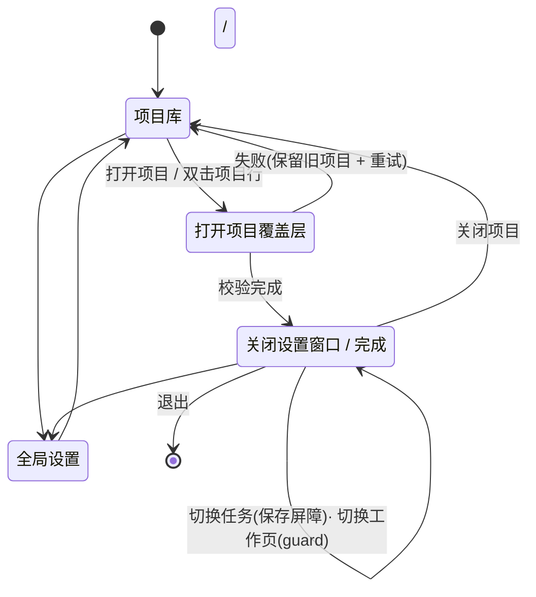

# SlateSync 新版前端 UI · 交互逻辑地图

> 描述界面之间"谁通往谁、什么条件下可通往、被什么拦住"。
> 所有规则都在 [prototype.html](prototype.html) 中有可点击的实现。
> 2026-09-14 第一轮实施记录与偏差(行→页映射不实现、表内状态循环不做、徽章过滤改为展开详情)
> 见根目录 `AGENT.md`。

---

## 一、信息架构

```text
应用外壳(导航栏 208px,常驻)
├── 项目库            ← 启动落点
├── 工作台            ← 门卫视图:未打开项目时显示引导空态
├── 日志
├── 帮助(工作流总览)
└── 底部:全局设置(macOS Settings 场景)· 外观切换 · 密度切换

工作台(打开项目后的主场)
├── 工具栏:项目身份(SlateBadge+名称)· 当前任务 · 保存状态 · 项目设置 · 导出
├── 任务栏(224px,可隐藏):搜索 + 任务列表(状态/条数)
├── 工作区:三段工作页 原稿 → 识别结果 → Resolve CSV
└── 状态栏(30px):操作反馈 · 任务统计 · Provider/模型/OCR 引擎

叠加层与辅助窗口
├── 打开项目(不确定进度覆盖层,不遮挡底部状态栏)
├── 全局设置(专用 macOS Settings 窗口,默认 780×620,五段:通用/Provider/识别/OCR/高级)
├── 危险操作确认(输入名称解锁)
└── 保存屏障(未保存修改:保存并切换 / 放弃修改 / 取消)
```

设计意图:**"项目库"与"工作台"是仅有的两个重量级视图**；设置使用原生 macOS Settings 场景，
确认与进度才是叠加层。用户永远能从状态栏知道"系统正在做什么",从工具栏知道"我在哪个项目的哪个任务"。

---

## 二、界面流转状态机



### 门卫规则(Guard)

| 动作 | 前置条件 | 不满足时 |
| --- | --- | --- |
| 进入工作台 | 已打开活跃项目 | 显示空态:「请先从项目库打开一个活跃项目」+ 去项目库按钮 |
| 切换任务 | 当前任务无未保存修改 | 保存屏障三选一;取消则原地不动 |
| 进入「识别结果」页 | 当前任务识别完成(或有本地 CSV 结果) | 空态:「请先在输入页选择场记单并开始识别」 |
| 进入「Resolve CSV」页 | 已载入 CSV 或已有识别结果 | 空态:「请先导入 CSV…」 |
| 开始识别 | 已选 Provider + 模型 + 已导入场记单 | 配置面板内联提示「请在识别配置中选择服务商和模型」,不弹窗 |
| 导出 CSV | 已载入 CSV | 未载入时先通过空态导入;存在未处理告警时,导出确认中逐条列出,提供「返回校对」与「留空导出」两条路 |

**原则:guard 用空态说明"缺什么、去哪补",永远不用 alert 阻挡;危险操作才用模态。**

---

## 三、核心流程(带反馈词汇)

### 1. 打开项目

```text
项目库行 [打开] → 覆盖层:斜纹小徽标 + 项目名 + 阶段文字 + 原生不确定进度条
  阶段:正在读取项目索引… → 正在校验任务数据… → 完成
成功 → 进入工作台,任务栏自动选中最近编辑的任务
失败 → 回项目库,状态栏报错 + 行内 [重试];覆盖层不估算百分比
```

### 2. 识别(信任链的第一次确认)

```text
原稿页:灯箱预览(页码器) + 右侧识别配置(300px)
  [开始识别] → 按钮变 [取消识别];状态栏:识别中 · 第 n/7 页…
  灯箱上方出现真实识别进度(LeaderProgress),页码器跟随翻页
完成 → 保持当前页面;状态栏:识别完成 · 12 条结果 + [查看识别结果],结果 tab 点亮 accent 圆点
中途取消 → 保留已完成页,状态栏:已取消 · 已识别 3 页
```

### 3. 校对(铅笔圈的舞台)

```text
识别结果页:结果表(条/场/镜/次/状态/置信度/备注)
  单行:点击状态徽章循环 待定 → 好条 → 保条 → 作废(好条触发铅笔圈描边动画)
  任何修改 → 工具栏保存状态变「未保存更改」,⌘S 或自动保存清除
  右侧 420px 原稿对照:点击行,灯箱同步翻到该条所在页
[合并识别结果] → 汇入 Resolve CSV 数据;CSV tab 出现圆点;状态栏:已合并 12 条
```

### 4. 对账与导出(信任链的第二次确认)

```text
Resolve CSV 页:告警徽章条(条号缺失 n · 场镜次序 n · 未匹配 n)
  点击徽章 → 过滤表格;问题行 = warn/danger dim 底 + 3px 左缘 + [校对] 按钮
  校对弹层:指定素材 / 标记作废 / 留空导出 → 表格即时刷新,徽章计数递减
[导出 CSV…] → 确认层:列出未确认字段 → [返回校对] 或 [留空导出]
导出完成 → 状态栏:已导出 Resolve.csv(第2拍摄日)· 保留原格式;表格状态全部转「已回填」
```

### 5. 全局设置

```text
入口:导航栏底部齿轮或 ⌘, (项目库/工作台均可)→ 专用 macOS Settings 窗口(默认 780×620)
五段 segment:通用 / Provider / 识别 / OCR / 高级(记忆上次停留)
Provider 段:凭据四态徽章;编辑不落盘,[保存配置] 才生效;Esc/关闭时若有未保存修改 → 屏障
OCR 段:PaddleOCR 未安装 → [安装 PaddleOCR] 引导;安装中不阻塞其他段
关闭设置窗口 → 回到来源视图;设置窗口保持原生 Form、Picker、焦点和键盘行为
```

---

## 四、跨界面的一致性规则

1. **状态栏是唯一异步发言人**:所有异步操作(识别、扫描、导入、导出、安装)的生命周期
   都显示在共享 `SlateStatusBar`;操作结束词汇与按钮动词一致(`导出 CSV…` → `已导出 Resolve.csv`)。
   需要用户修复的字段错误仍保留在所属表单/表格内联显示,不另起 toast。
2. **保存屏障无处不在且行为一致**:任务切换、关闭项目、关闭设置,统一三选一。
3. **tab 圆点 = "那边有新东西"**:识别完成点亮结果 tab,合并完成点亮 CSV tab,
   用户访问后熄灭;圆点必须有对应的 VoiceOver 文案,不单靠颜色或位置传达。
4. **颜色语义全产品统一(沿用现行语义对)**:accent=进行中/选中;warn=待人工;ok=已确认;danger=不可恢复。
5. **键盘**:`⌘1/2/3` 切工作页 · `⌘,` 打开设置 · `⌘S` 保存 · `/` 聚焦搜索 · `Esc`
   关闭最上层弹层或取消当前可取消操作。设置窗口遵循 macOS 原生窗口关闭和焦点恢复。
   焦点环用 accent,全键盘可达。
6. **空态是路标**:每个空态必须包含 ①现在缺什么 ②去哪补 ③一个直接动作。
